# 🎱 大乐透历史开奖数据分析

基于真实历史开奖数据的中国体育彩票「超级大乐透」分析工具：单文件网页应用 + 零依赖本地服务器，数据内嵌、可一键在线更新，无需安装任何第三方 npm 包。

> ⚠️ **免责声明**：本项目仅用于数据分析与技术学习。所有统计、走势与"预测"结果**仅供娱乐参考，不构成任何购彩建议**。彩票开奖是独立随机事件，请理性购彩、量力而行。

## ✨ 功能特性

- 📜 **玩法规则速查**（2026 新规）
- 🎯 **中奖查询**：输入号码，按 2026 新规自动判定奖级
- 🕒 **最新一期开奖**速览
- 💰 **奖池走势**（每期开奖后滚存）
- 📋 **号码走势图**（近 N 期可调，点击号码查看统计）
- 📊 **号码出现频率**
- 📈 **前区和值走势**（20 期 / 50 期均线）
- 📐 **结构分布**（大小、奇偶等）
- ⏳ **遗漏分析**（表头可排序）
- 🎯 **号码热度矩阵**（点击号码查看详情）
- 🔗 **高频组合与连号**
- 🎲 **模拟选号**（仅供娱乐）
- 🔮 **下一期号码预测**（7 种统计方法，仅供娱乐）
- 🗂️ **历史开奖记录**（最新在前，可搜索翻页）
- 🔄 **在线更新**：一键抓取体彩官网最新开奖数据，自动缓存到浏览器 localStorage

## 📸 界面截图

以下截图均为实际运行效果（内置数据 · 2911 期，最新一期 26093 期 · 2026-08-17）：

<p align="center">
  
  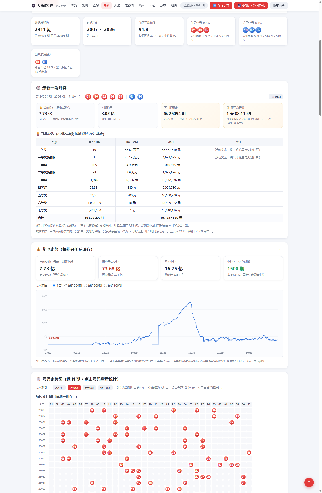
</p>

<p align="center">
  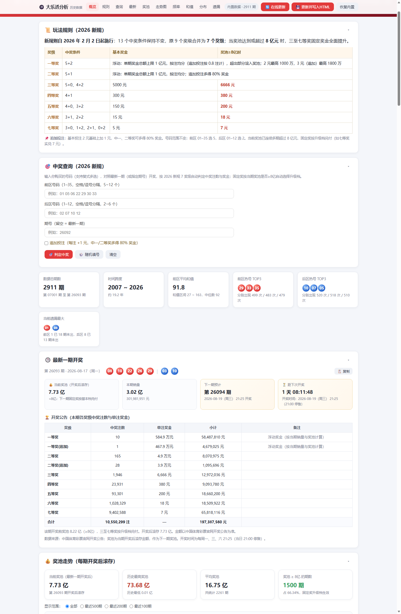
  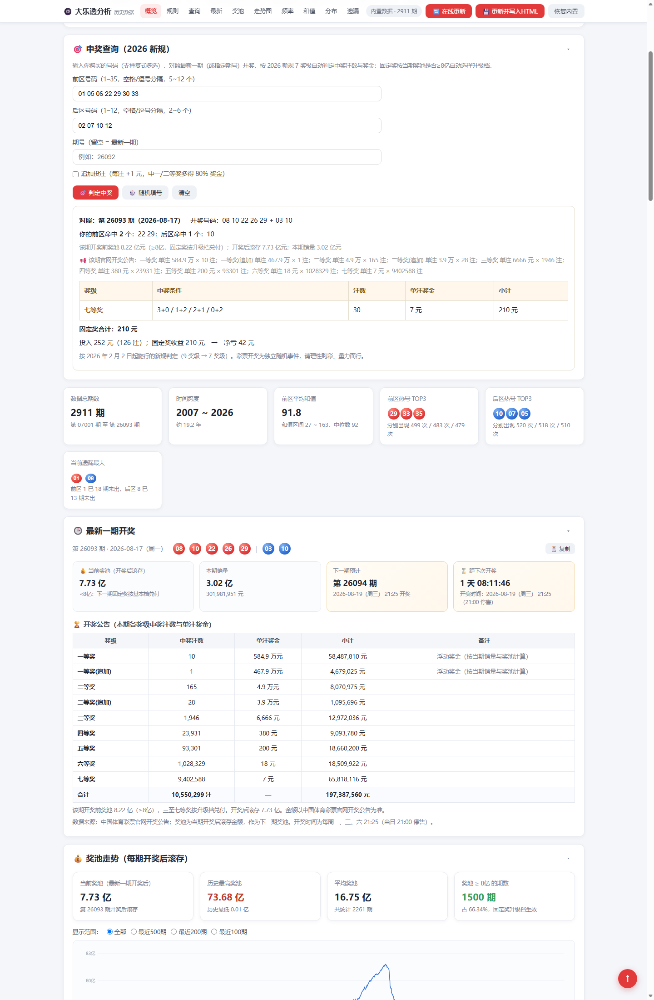
</p>

<p align="center">
  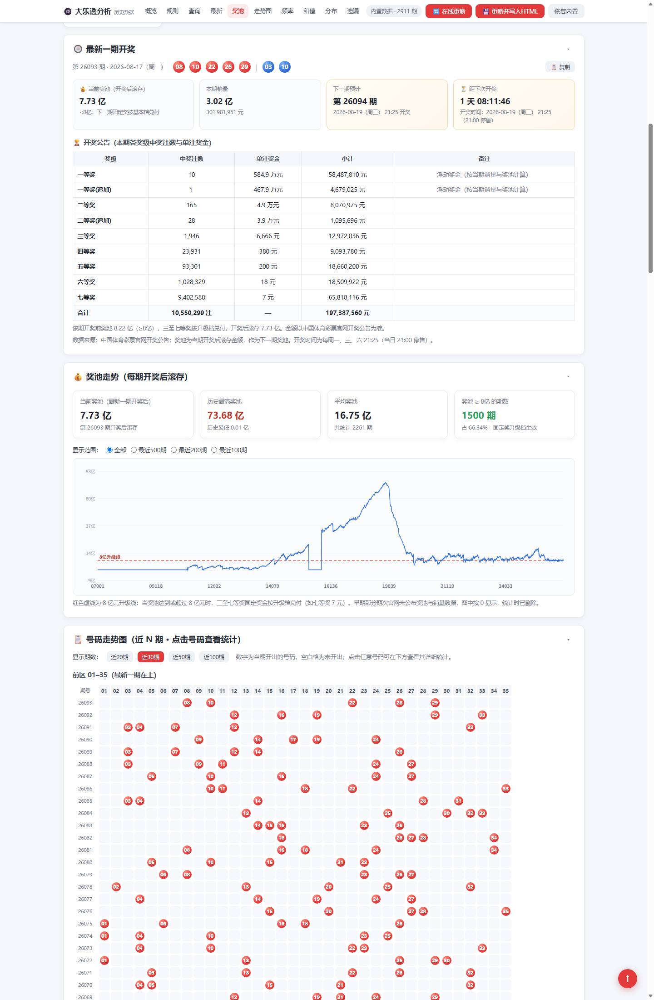
  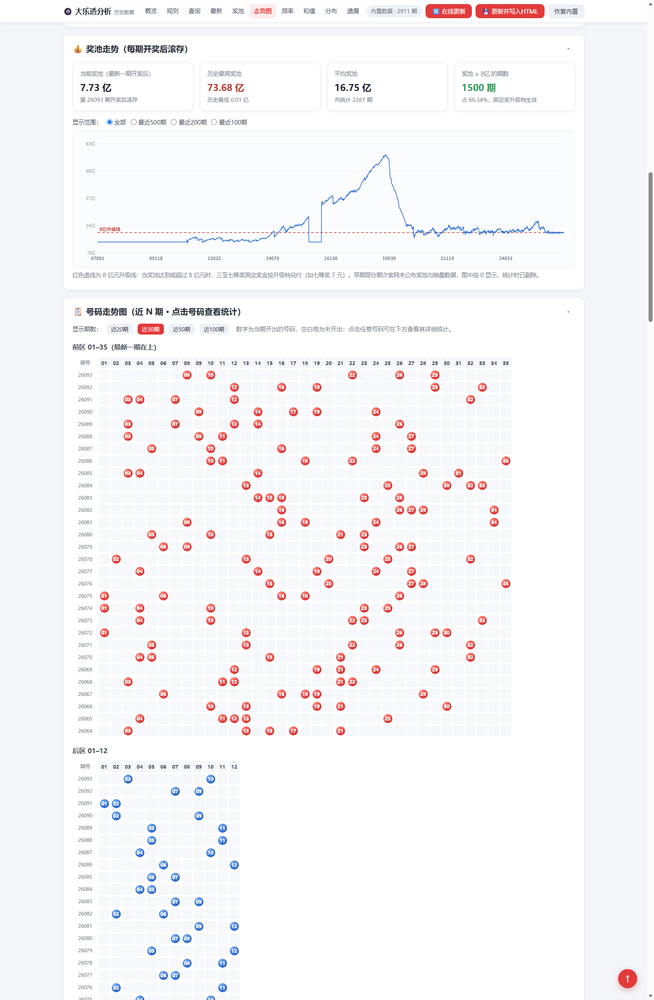
</p>

<p align="center">
  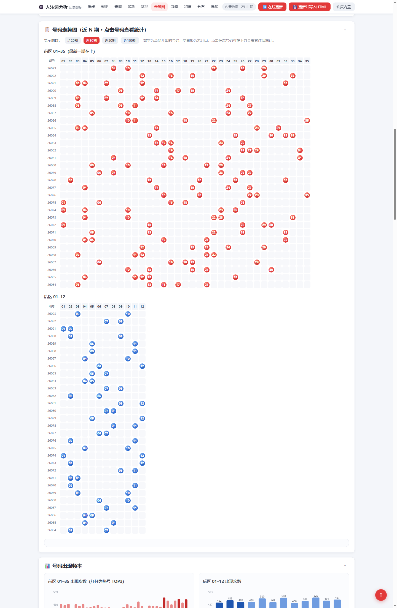
  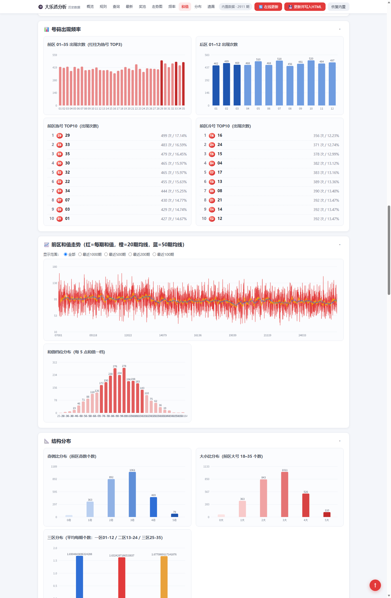
</p>

<p align="center">
  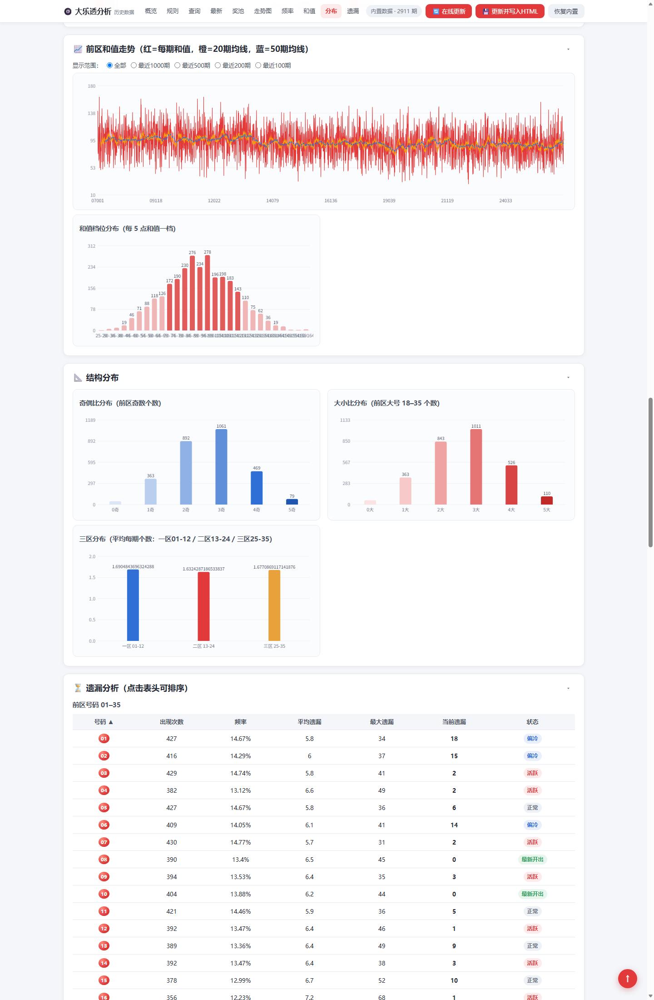
  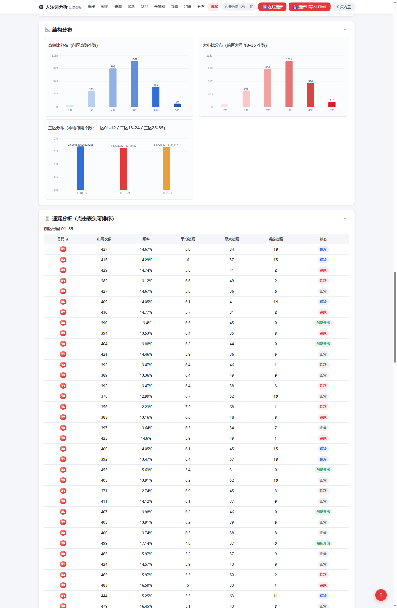
</p>

<p align="center">
  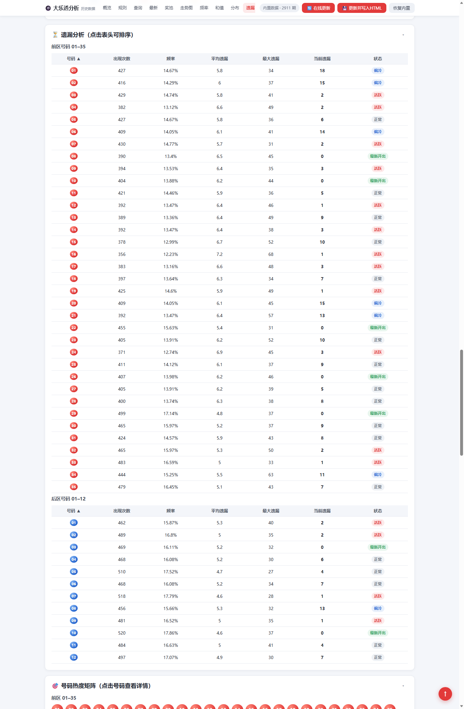
  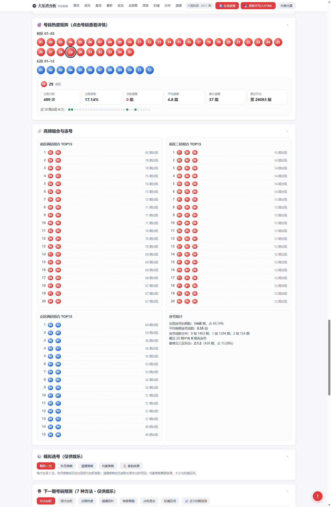
</p>

<p align="center">
  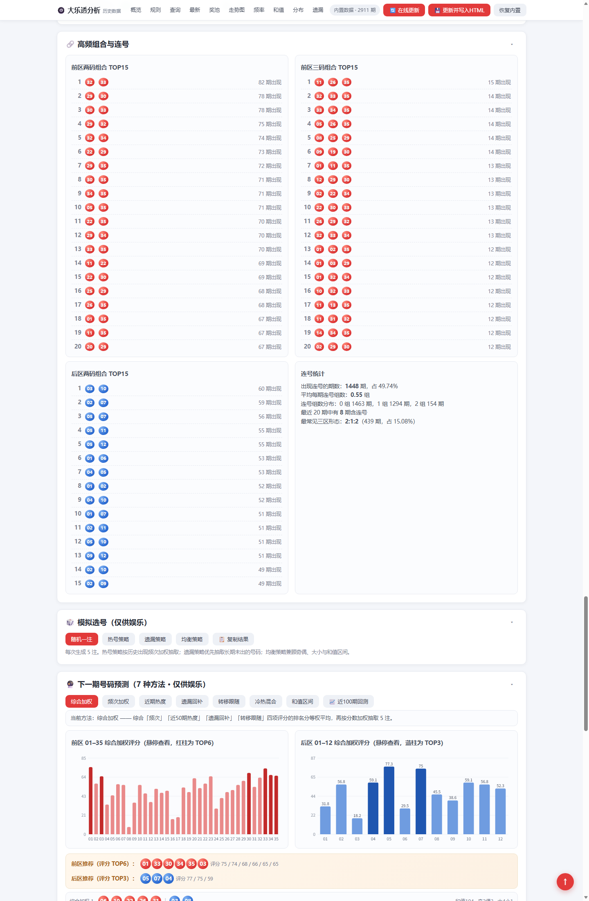
  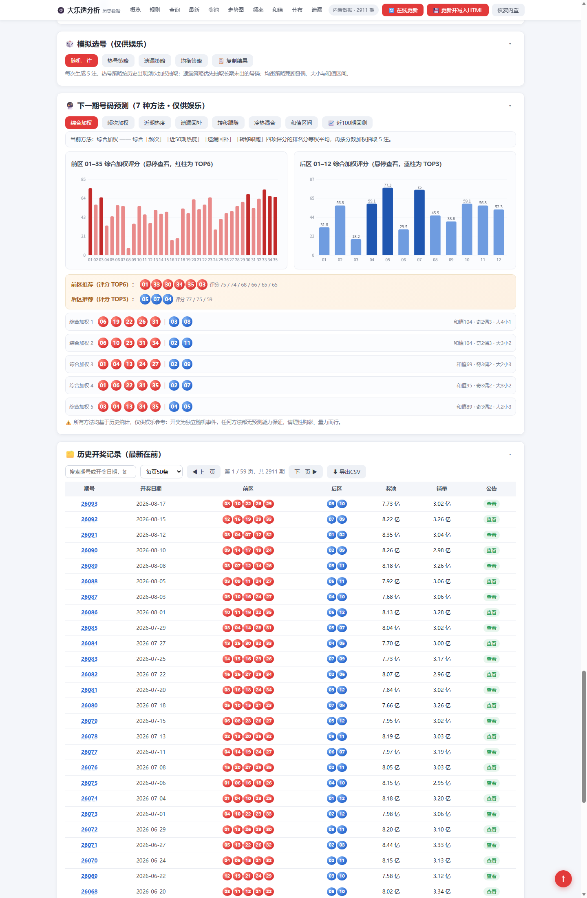
</p>

<p align="center">
  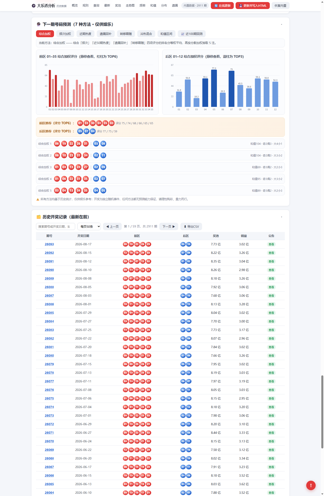
  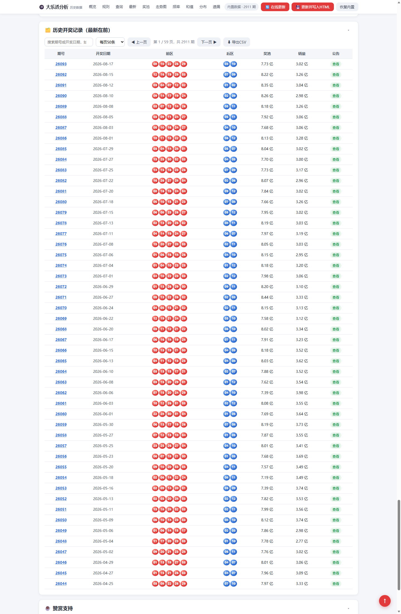
</p>

## 🚀 快速开始

### 环境要求

- **Node.js ≥ 18**（使用内置 `fetch`；项目零第三方依赖，无需 `npm install`）

### 启动

Windows 用户直接双击 `启动页面.bat`（自动启动服务器并打开浏览器），或任意平台手动执行：

```bash
node server.js
```

然后浏览器访问 **http://127.0.0.1:8123/**

> **为什么要本地服务器？**
> 浏览器禁止 `file://` 页面发起跨域 fetch 请求，所以直接双击 HTML 文件时「🔄 在线更新」不可用。
> `server.js` 同时充当体彩官网接口的代理（绕过 CORS / HTTP/2 限制），且只监听 `127.0.0.1`，仅本机可访问。

### 更新数据

- 页面内点击「🔄 在线更新」按钮（结果缓存到浏览器 localStorage）；或
- 命令行执行 `node update.js`（抓取全量历史 → 校验 → 重建页面内嵌数据块，二者结果一致）

## 📁 项目结构

| 文件 | 说明 |
| --- | --- |
| `大乐透历史数据分析.html` | 单文件网页应用，内嵌全部历史开奖数据（`RAW_DATA` 块） |
| `server.js` | 本地静态服务器 + 体彩官网接口代理 + 数据写回接口 |
| `update.js` | 离线数据更新脚本 |
| `启动页面.bat` | Windows 一键启动器（启动服务器并打开浏览器） |
| `赞赏码.jpg` | 赞赏支持二维码（页面底部「☕ 赞赏支持」面板 / README 展示） |
| `screenshots/` | 项目界面截图（README「📸 界面截图」展示用） |

## 📊 数据来源

- 开奖数据来自**中国体育彩票官网**公开接口（`webapi.sporttery.cn`），由脚本抓取、校验后内嵌于页面
- 数据格式 v2：每期为 `[期号, 开奖日期, 前区[5], 后区[2], 奖池, 销量, 开奖公告]`

## 🔧 开发说明

- 页面内嵌数据块以 `const RAW_DATA = ` 标记定位，编辑页面布局时请保留该标记
- `server.js` 的 `/save-data` 写回接口仅监听 `127.0.0.1`，只服务本机

## ☕ 赞赏支持

如果这个工具对你有帮助，欢迎扫码赞赏支持一下作者（完全自愿，不赞赏也不影响任何功能使用）：

<p align="center"></p>

## 📄 License

[MIT](./LICENSE)
